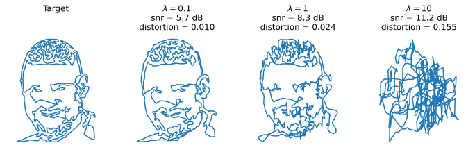

# Artistic Curve Steganography Carried by Musical Audio

## <a href = "https://www.ctralie.com">Chris Tralie</a>

## <a href = "https://arxiv.org/pdf/2301.12354.pdf">Paper Link</a>

### <a href = "https://www.evostar.org/2023/evomusart/">Proceedings of the 12th International Conference on Artificial Intelligence in Music, Sound, Art, And Design</a></h3>

## Abstract
  In this work, we create artistic closed loop curves that trace out images and 3D shapes, which we then hide in musical audio as a form of steganography.  We use traveling salesperson art to create artistic plane loops to trace out image contours, and we use Hamiltonian cycles on triangle meshes to create artistic space loops that fill out 3D surfaces. Our embedding scheme is designed to faithfully preserve the geometry of these loops after lossy compression, while keeping their presence undetectable to the audio listener. To accomplish this, we hide each dimension of the curve in a different frequency, and we perturb a sliding window sum of the magnitude of that frequency to best match the target curve at that dimension, while hiding scale information in that frequency's phase.  In the process, we exploit geometric properties of the curves to help to more effectively hide and recover them.  Our scheme is simple and encoding happens efficiently with a nonnegative least squares framework, while decoding is trivial.  We validate our technique quantitatively on large datasets of images and audio, and we show results of a crowd sourced listening test that validate that the hidden information is indeed unobtrusive.
  
## Python dependencies
numpy, matplotlib, librosa, scikit-image, scipy, scikit-learn
  
## Javascript Live Demo

<a href = "https://ctralie.github.io/AudioCurveSteganography/viewer/examples/">Click here</a> to interactively view a set of precomputed examples.  I've implemented a WebGL viewer that decodes the hidden curves and synchronizes them to the music they're hidden inside live as it plays.  You can vary the parameters and see how this effects the decoded curve.  Have fun!

<b>NOTE</b>: This has only been tested in Firefox and Chrome

## Trying Your Own Examples

Have a look at the notebooks in the <code>viewer/examples</code> directory to see how the examples in the above demo were created.  Once you've created the audio, you can upload and decode it at <a href = "https://ctralie.github.io/AudioCurveSteganography/viewer/viewer.html">this link</a>

## Supplementary Results

Figures, inculding supplementary results, can be found in the <code>figures/</code> directory
